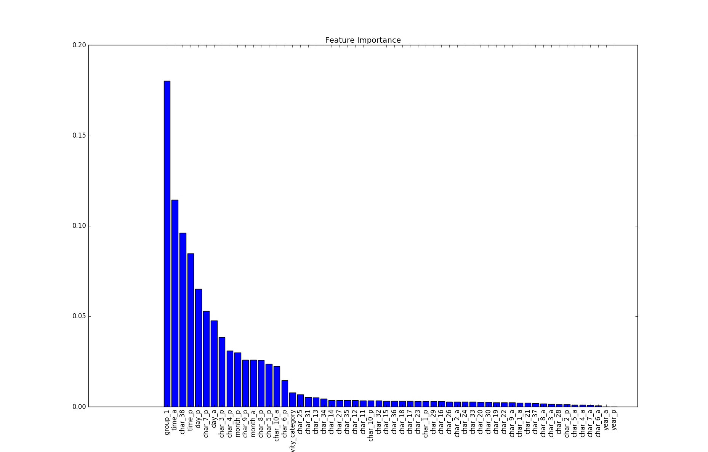
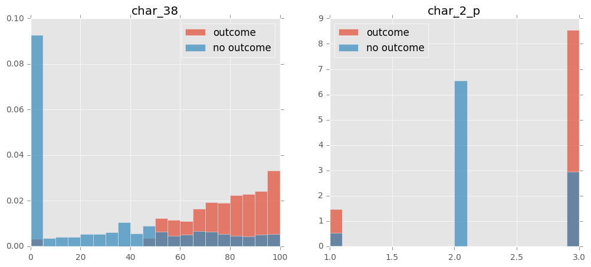
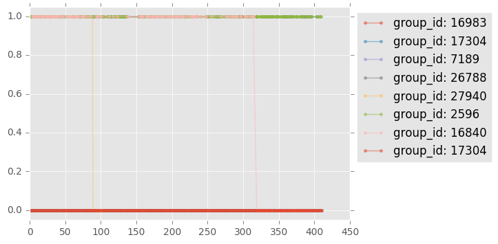

# Predicting Red Hat Business Value
This repo is my solution for kaggle challenge: Predicting Red Hat Business Value. Data are not in included, which can be get from [kaggle page](https://www.kaggle.com/c/predicting-red-hat-business-value).  
## 1. Data Preparation
There are two table in this dataset: people and activity.

## 2. Model Selection

## 3. Result

## 4. Data Leakage

